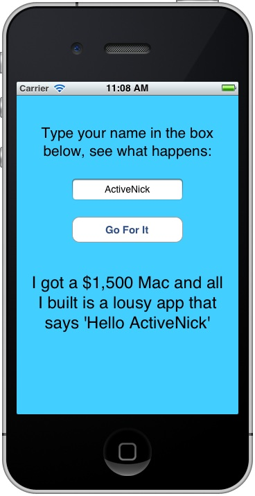

# FrenchFlashCards
From my archives, this is the second iPhone app that I built back when I was learning iOS development in Objective-C in 2012. The term "app" is generous given that this is merely the result of a tutorial I followed in the [Big Nerd Ranch Guide to iOS Development](https://www.bignerdranch.com/we-write/ios-programming/). The first iPhone app was the iOS "Hello World" from the Apple docs, which took me 2 hours to complete. See the amazing results in the screenshot below. 

I was dismayed at how long it took to build a glorified "Hello World" app in Objective-C (compared to .NET), which is what prompted me to start teach conference sessions on **["iOS Development Survival Guide for the .NET Guy (or Gal)](http://www.slideshare.net/ActiveNick/ios-development-survival-guide-for-the-net-guy)** back at the [Heartland DevCon (HDC)](http://careerlink.com/hdc/) in Omaha in September 2012, and subsequently at other events like [VSLive](http://vslive.com) and others. This app was the live coding model I was using during these talks.

FrenchFlashCards is a simple app that simulates study flash cards where it shows you a simple statement in English, and the user would have to try and remember the French translation, before verifying the answer. It's a really dump app sample.

## "Hello World" Screenshot

## Follow Me
* Twitter: [@ActiveNick](http://twitter.com/ActiveNick)
* Blog: [AgeofMobility.com](http://AgeofMobility.com)
* SlideShare: [http://www.slideshare.net/ActiveNick](http://www.slideshare.net/ActiveNick)
